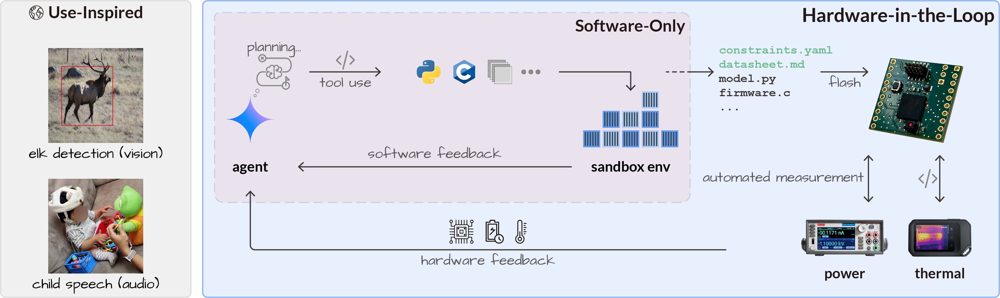

<p align="center">
  
</p>

# EmbeddedArena

[](https://github.com/ubicomplab/embedded-arena/actions/workflows/ci.yml)
[](https://www.python.org/)
[](LICENSE)
[](https://www.docker.com/)
[](docs/hardware.md)

EmbeddedArena is a public benchmark for agentic embedded AI deployment. Agents iteratively edit model or firmware artifacts; the framework compiles, flashes, and validates those artifacts; and the score comes from real hardware measurements such as deployability, current, energy, and temperature.

<p align="center">
  
</p>

## Quickstart

The smoke test below does not require physical hardware. It verifies the Python package, Docker sandbox, CLI runner, scripted model adapter, checks, and output logging.

```bash
git clone https://github.com/ubicomplab/embedded-arena.git
cd embedded-arena
python3 scripts/check_python.py
python3 -m venv .venv
source .venv/bin/activate
python -m pip install -U pip setuptools wheel
python -m pip install -e '.[providers,dev]'
cp .env.example .env
embedded-arena doctor

CLI_LLM_SCRIPT=examples/cli_smoke_gradient_flow.jsonl \
  embedded-arena run configs/smoke/gradient-flow.yaml \
  --llm cli/scripted \
  --iterations 1 \
  --output-dir outputs/smoke \
  --overwrite
```

EmbeddedArena supports Python 3.10 or newer. Docker must be running before benchmark execution. The sandbox defaults to `~/.cache/embedded-arena/sandboxes/default`; blank `.env` values for `EMBEDDED_ARENA_CACHE_DIR` and `EMBEDDED_ARENA_SANDBOX_PATH` use that default. The runner refuses sandbox paths inside the repository and only cleans directories marked with `.embedded-arena-sandbox`.

## What Is Included

- Paper-aligned benchmark configs for model compression, MAX78000 power minimization, and ESP32-S3 thermal management.
- Deterministic check interfaces under `embedded_arena/checks/`.
- Host-side hardware drivers under `embedded_arena/hardware/`.
- Seed firmware under `firmware/`, with third-party provenance notes.
- Setup scripts for MAX78000/ai8x, ESP-IDF, STM32Cube.AI/STEdgeAI, Hugging Face assets, and optional remote training.

## Documentation

Start with [the documentation index](docs/README.md). The most common paths are:

| Goal | Start here |
| --- | --- |
| Run the no-hardware smoke test | [Setup](docs/setup.md) |
| Bring up MAX78000 power measurements | [MAX78000 hardware setup](docs/hardware.md#max78000-power-and-energy) |
| Bring up ESP32 thermal measurements | [ESP32-S3 thermal setup](docs/hardware.md#esp32-s3-thermal-management) |
| Configure STM32N6 model compression | [STM32N6 setup](docs/setup.md#stm32n6-toolchain) |
| Download external datasets/assets | [Data and assets](docs/data-assets.md) |
| Add a new benchmark | [Adding hardware and experiments](docs/adding-hardware.md) |

## Contributing

The primary contribution path is adding new hardware targets or new experiments for existing targets. A complete benchmark contribution should include deterministic checks, curated seed artifacts, hardware/setup docs, and baseline runs on at least the latest generally available OpenAI model, the latest generally available Google Gemini model, and one additional model of your choice. See [CONTRIBUTING.md](CONTRIBUTING.md).

## Citation

If you use EmbeddedArena, please cite the arXiv preprint:

```bibtex
@misc{zhang2026embeddedarenaiterativeoptimization,
      title={Embedded Arena: Iterative Optimization via Hardware Feedback},
      author={Zhihan Zhang and Alexander Le Metzger and Jiuyang Lyu and Chun-Cheng Chang and Jiayi Shao and Yujia Liu and Emmanuel Azuh Mensah and Edward Wang and Kurtis Heimerl and Gregory D. Abowd and Shwetak Patel and Natasha Jaques and Vikram Iyer},
      year={2026},
      eprint={2606.16190},
      archivePrefix={arXiv},
      primaryClass={cs.AR},
      url={https://arxiv.org/abs/2606.16190},
}
```
