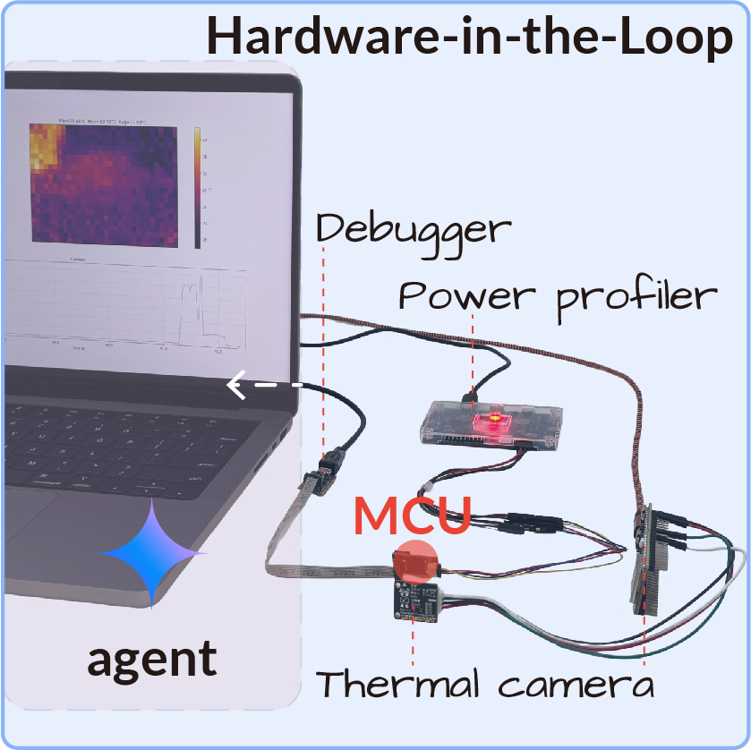

# EmbeddedArena Documentation

**Docs:** [Overview](README.md) | [Setup](setup.md) | [Hardware](hardware.md) | [Data/assets](data-assets.md) | [Experiments](experiments.md) | [Results](results.md) | [Adding benchmarks](adding-hardware.md) | [Model providers](model-providers.md) | [Safety](safety.md)

EmbeddedArena turns embedded AI deployment into a repeatable hardware-in-the-loop benchmark: an agent edits artifacts, the framework builds and tests them, and real instruments return structured feedback for the next iteration.

<p align="center">
  
</p>

## First-Time Setup Path

1. Install the Python package and Docker using [Setup](setup.md).
2. Run the no-hardware smoke test in [Experiments](experiments.md#smoke-test).
3. Install only the target-specific toolchain you need:
   - [MAX78000 power and compression](setup.md#max78000-toolchain)
   - [ESP32-S3 thermal management](setup.md#esp32-s3-toolchain)
   - [STM32N6 compression](setup.md#stm32n6-toolchain)
4. Wire and test hardware using [Hardware](hardware.md).
5. Download large datasets and gated vendor/model assets using [Data/assets](data-assets.md).
6. Run paper-aligned configs from [Experiments](experiments.md).

## Documentation Map

| Page | Use it for |
| --- | --- |
| [Setup](setup.md) | Python, Docker, provider keys, host toolchains, and setup scripts. |
| [Hardware](hardware.md) | Physical wiring, instruments, firmware targets, and bring-up checks. |
| [Data/assets](data-assets.md) | Hugging Face assets, COCO/model placeholders, vendor caches, and `.data/`. |
| [Experiments](experiments.md) | Config layout, smoke tests, paper benchmark commands, resume, and outputs. |
| [Results](results.md) | Reading `summary.json`, `run.log`, feedback images, and plotting utilities. |
| [Adding benchmarks](adding-hardware.md) | Main contribution path for new hardware and experiments. |
| [Model providers](model-providers.md) | OpenAI, Gemini, Claude, Ollama, and scripted adapters. |
| [Safety](safety.md) | Sandbox guardrails, recoverability, power, thermal, and secret handling. |

## Repository Layout

```text
embedded_arena/          Python package: runner, checks, hardware drivers, LLM adapters
configs/                 Smoke tests and paper-aligned benchmark YAML
firmware/                Seed firmware copied into agent sandboxes
data/documentation/      Small curated docs safe to include in agent context
docs/                    Human setup and contribution docs
scripts/                 Setup, validation, baseline, and analysis helpers
```

Large datasets, vendor toolchains, model snapshots, and generated outputs are intentionally kept out of git; see [Data/assets](data-assets.md).
