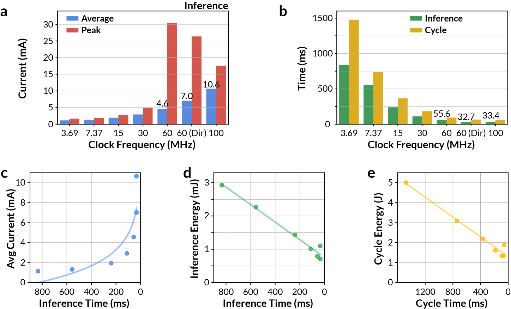
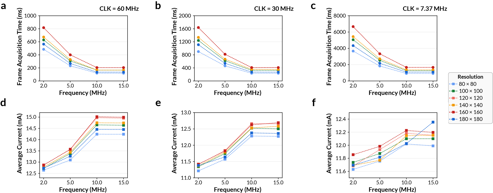
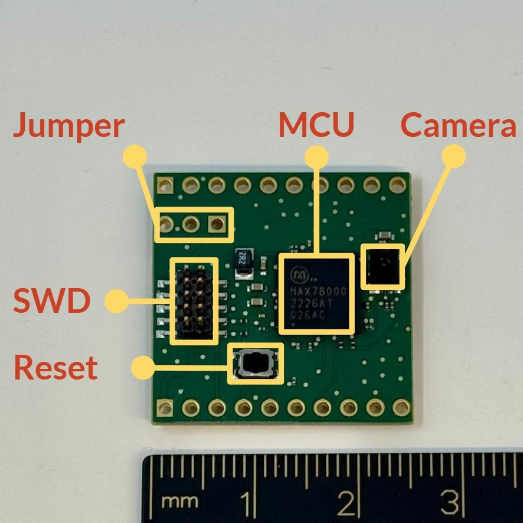
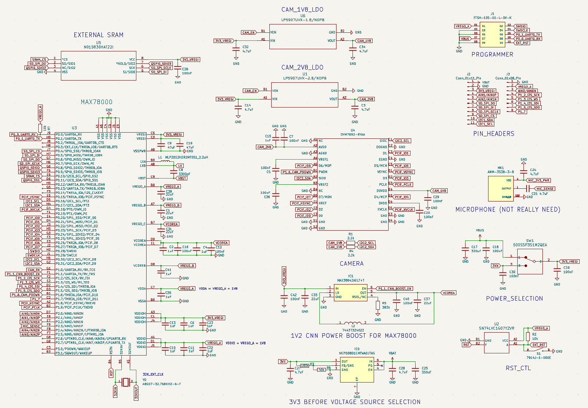
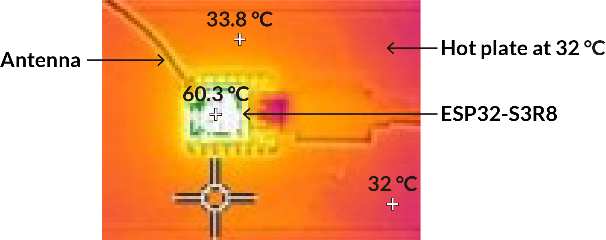
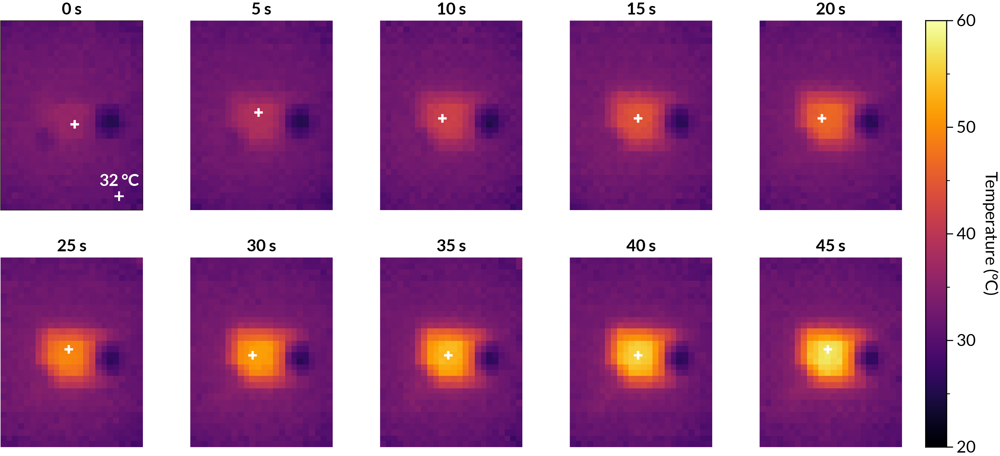

# Hardware Setup

**Docs:** [Overview](README.md) | [Setup](setup.md) | [Hardware](hardware.md) | [Data/assets](data-assets.md) | [Experiments](experiments.md) | [Results](results.md) | [Adding benchmarks](adding-hardware.md) | [Model providers](model-providers.md) | [Safety](safety.md)

This page describes the physical setups used by the paper-aligned benchmarks. Hardware checks run on the host because they need direct USB access to debuggers, serial ports, power profilers, and thermal cameras.

<p align="center">
  
</p>

## MAX78000 Power And Energy

Used by:

- `configs/benchmarks/power/max78000/peak-current/*.yaml`
- `configs/benchmarks/power/max78000/total-energy/*.yaml`
- `configs/benchmarks/compression/max78000/*.yaml` for synthesis/deployability checks

Seed firmware: `firmware/max78000/yolo-pico/`, adapted from [SanderGi/YADES](https://github.com/SanderGi/YADES).

### Required Equipment

- MAX78000 board or compatible MAX78000 camera platform.
- Live camera module connected to the firmware's expected camera interface.
- SWD/JTAG debugger supported by the Maxim SDK/OpenOCD path, such as CMSIS-DAP or J-Link.
- UART/USB serial connection for stage logs and checkpoint detection.
- [Nordic Power Profiler Kit II](https://www.nordicsemi.com/Products/Development-hardware/Power-Profiler-Kit-2) configured as a 3.3 V source meter.
- Optional ESP32-S3 + MLX90640 IR camera bridge if `capture_thermal=true`.

### Wiring And Measurement Flow

1. Connect the PPK2 in source-meter mode. Set the source voltage to 3.3 V and power the MAX78000 board through the PPK2 output.
2. Connect SWD/JTAG from the debugger to the board. Keep the debugger ground tied to the PPK2/device ground.
3. Connect the board UART to the host. The measurement check captures UART output and requires the completion checkpoint.
4. Keep the camera connected and visible to the scene expected by the seed firmware. The benchmark rejects firmware that bypasses live sensor input.
5. Run `./scripts/setup_max78000.sh`, load `.env`, and install `.[hardware]`.

The HIL check sequence is:

| Check | What it does | Agent-controlled fields |
| --- | --- | --- |
| `compile_max78000.py` | Runs `make` on the sandbox firmware project with the Maxim SDK. | `project_dir`, `project_name` |
| `flash_max78000.py` | Enables PPK2 power, mass-erases the device, and flashes the ELF over SWD/JTAG. | `project_dir`, `project_name` |
| `measure_max78000.py` | Captures current, UART, and optional thermal frames for the YAML-fixed window. | `project_dir`, `project_name`, `firmware_behavior_description` |

The paper power tasks use a 20 s current trace at 3.3 V. A valid firmware must preserve five live camera inference cycles, stage logging, CNN execution, post-processing, and the final `firmware task complete checkpoint` line.

### MAX78000 Platform Notes

The MAX78000 CNN accelerator has dedicated SRAM for model weights and inference data. Clock routing matters: direct 60 MHz CNN clocking can increase instantaneous current while reducing completion time enough to lower total energy. The hardware guide figures below are useful when debugging power changes:

<p align="center">
  
</p>

<p align="center">
  
</p>

### Custom MAX78000 PCB

The paper also describes a custom MAX78000 PCB for wildlife monitoring. It integrates the MAX78000 SoC, OVM7692 camera, external SRAM, SWD, and a power module with rails for the MCU and camera domains.

<p align="center">
  
</p>

<p align="center">
  
</p>

## ESP32-S3 Thermal Management

Used by:

- `configs/benchmarks/thermal/esp32/room/*.yaml`
- `configs/benchmarks/thermal/esp32/contact/*.yaml`

Seed firmware: `firmware/esp32/tinyllama/`, adapted from [DaveBben/esp32-llm](https://github.com/DaveBben/esp32-llm).

### Required Equipment

- ESP32-S3 target board with PSRAM suitable for the TinyLLaMA 260K firmware workload.
- USB serial/JTAG connection used by ESP-IDF flashing and UART capture.
- Separate ESP32-S3 board running the MLX90640 IR camera bridge firmware from `firmware/ir-camera/`.
- MLX90640 thermal camera module wired to the bridge over I2C.
- Optional contact-heated surface or heat pad for the skin-contact variant.

### Thermal Camera Bridge

The bridge firmware streams MLX90640 frames to the host driver at the configured frame rate. Flash it once:

```bash
cd firmware/ir-camera
pio run -t upload
cd ../..
python scripts/test_ir_camera.py
```

Keep the target ESP32-S3 centered in the MLX90640 field of view and avoid reflective surfaces. The room-temperature task records a 60 s thermal window at 32 Hz. The contact variant repeats the workload on a warmed contact surface of roughly 32 to 33 deg C.

<p align="center">
  
</p>

<p align="center">
  
</p>

### Workload Contract

The benchmark firmware must:

- Print `READY`, then block on a host start byte so the measurement window has a deterministic t=0.
- Bring up WiFi as a SoftAP and stream generated token pieces over UDP.
- Run all required TinyLLaMA prompts; generated text quality is not scored.
- Print `firmware task complete checkpoint` before the measurement window ends.
- Remain recoverable for the next flash.

The room task uses the standard UDP fan-out. The contact-heated task is stricter and includes additional workload requirements such as more logical clients and internal temperature sample buffering.

## STM32N6 Compression

Used by:

- `configs/benchmarks/compression/stm32n6/*.yaml`
- `configs/smoke/synthesis-stm32n6.yaml`
- `configs/smoke/stm32-speech-train-synthesis.yaml`

The STM32N6 benchmark is primarily a synthesis/deployability flow rather than a live power measurement setup. The default target is NUCLEO-N657X0-Q / STM32N657X0H3Q with 512-Mbit Octo-SPI Flash and 4.2 MB contiguous SRAM. Install ST Edge AI / STM32Cube.AI using [Setup](setup.md#stm32n6-toolchain), then download Hugging Face assets using [Data/assets](data-assets.md#hugging-face-assets).

## Host Paths And Ports

Keep machine-specific details in `.env` or command-line overrides:

```bash
ESP32_PORT=/dev/tty.usbmodemXXXX
MAX78000_SERIAL_PORT=/dev/tty.usbmodemYYYY
MAX78000_JLINK_SERIAL=
STM32_PORT=
```

Benchmark YAML should describe the task and fixed measurement parameters. It should not hardcode a contributor's home directory. If you find a machine-specific port in a config, override it locally and include a cleanup patch in your PR.
